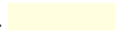
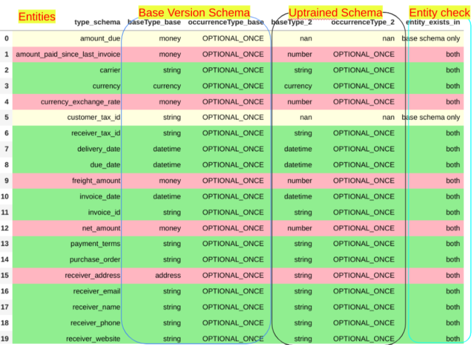

# Objective
This tool compare the schemas of a pretrained “base” processor and a customer's custom schema for uptraining, to highlight the differences in an easily readable (color-coded) format. 

This provides the information needed to correct 400 INVALID ARGUMENT errors encountered during Uptraining via Notebook. The schema given in the Uptraining notebook MUST be consistent with the base processor (no changes to base processor fields).  Additional custom fields are allowed, and base processor fields may be excluded.

Since the base version schema of each processor is fixed, the tool has the preloaded base version schema of 3 parsers as Below.
1. Invoice Parser
2. Purchase Order Parser
3. Contract Parser

The customer's Uptrained schema json file has to be given as input into this tool.  The user must copy this from their notebook before using this tool, and save it to a text file with a .json extension.
The Tool shows clear differences between the two schemas with color coding.

# Input details
1. Copy your schema into the Tool Code.
2. Parser Type: The Parser type input has to be given in single Alphabet as below 
    `I` - Invoice Parser
    `P` - Purchase Order Parser
    `C` - Contract Parser
        This input is not case sensitive.
        
# Output Details
The color coding is defined to show the clear difference between two schemas:  
* Green→ </img>→ Both the schema entities are perfectly matching.  
* Yellow→ </img>→The entities are in only one schema (exists in base schema or untrained schema).  
* Pink→ </img>→The entities exist in both the schemas and there is a mismatch. These fields must be changed in your notebook.  

The entities are listed in the first column, the 2nd and 3rd columns are for Base Version schema details or preloaded schema in this tool. 4th and 5th columns are Uptrained Schema details which are provided as input to this schema comparison tool.

The last column indicates Entities check, this shows whether entities exist either in one of the schema or both the schema. If it is the base schema then the entity exists only in the Base Version schema and does not exists in Uptrained Version and vice versa.

</img>  
The pink rows indicate fields that must be changed in your Uptraining notebook to be consistent with the base processor’s Type an OccurenceType.
