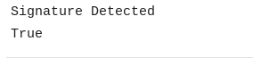

# Purpose and Description
This documentation outlines the procedure for detecting the signature in the document by taking normalized bounding box coordinates of signature location.
While using this code, the user needs to set two values while calling the function a) BlankLine Pixel count b)  Signature Pixel Count (only for the black pixels).

## 1. Input details

<ul>
    <li><b>input_path :</b> GCS Storage name. It should contain DocAI processed output json files. This bucket is used for processing input files in the folders.</li>
    <li><b>normalized_vertices: </b> 4 coordinates of the signature entity where it is expected to be present.
    <li><b>page_number: </b>Page Number where the signature is expected to be present
    <li><b>blank_line_pixel_count: </b>Count of the total black pixel (considering the image is a binary image(black & white)) of the blank signature field.
    <li><b>signature_threshold_pixel_count: </b>Threshold Count of the total black pixel (considering the image is a binary image(black & white)) signature field having signature in it.
</ul>

## 2.Output

upon execution code , it will prompt whether the given image with bounding box coordinates is having the signature in it or not.

<table>
    <tr>
        <td><h3><b>Input Json Image</b></h3></td>
        <td><h3><b>Output</b></h3></td>
    </tr>
<tr>
<td></td>
<td></td>
</tr>
</table>
