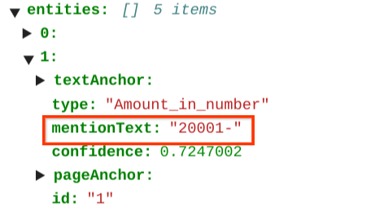
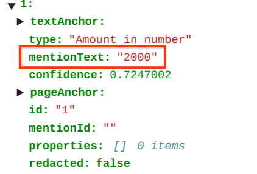

## Purpose and Description

This documentation outlines the procedure for handling special characters within the CDE JSON samples. It involves replacing the original mention text value with its corresponding post-processed value using the provided code.

## Prerequisites

1. Access to vertex AI Notebook or Google Colab
2. Python
3. Access to the google storage bucket.

## Step by Step procedure 

### 1. Input Details

<ul>
    <li><b>input_path : </b>It is input GCS folder path which contains DocumentAI processor JSON results</li>
    <li><b>output_path : </b> It is a GCS folder path to store post-processing results</li>
    <li><b>project_id : </b> It is the project id of the current project.</li>
    <li><b>location : </b> It is the location of the project in the processor.</li>
    <li><b>processor_id : </b> It is the cde processor id. </li>
    <li><b>entity_name : </b> The name of an entity to consider for cleaning and converting it with post processed value.</li>
    
</ul>

### 2.Output

The post processed json field can be found in the storage path provided by the user during the script execution that is output_bucket_path.  

<b>Comparison Between Input and Output File</b>  
<i><h4>Post processing results<h4><i> 
Upon code execution, the JSONs with the newly replaced values will be stored in the designated output Google Cloud Storage (GCS) bucket. This table summarizes the key differences between the input and output JSON files for the 'Amount_in_number' entity 
    
<table>
    <tr>
        <td><h3><b>Input Json </b></h3></td>
        <td><h3><b>Output Json</b></h3></td>
    </tr>
<tr>
<td></td>
<td></td>
</tr>
</table>