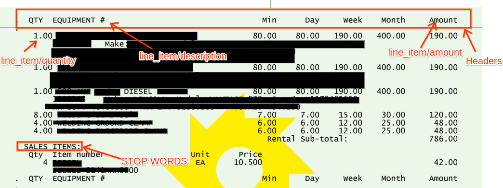
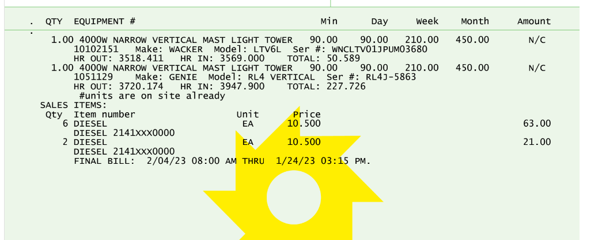
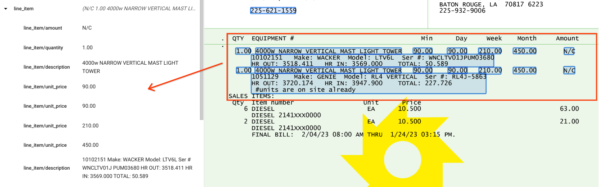

# Purpose and Description

This document provides the functions which can be used to get the line items tagged from a specific format where the default processor is failing to extract the line item entities.

## Note

* This tool tags as entities from OCR output , the text below the headers_entities keys will be tagged as an child entity as per value.
* If the line item has multiple lines , it doesnt give desired result and output will be clumsy

### Input details

* **project_id** :Your project id
* **Gcs_input_path** : Bucket path where the parsed jsons are stored
* **Gcs_output_path** : Bucket path to save the updated jsons

### Format specific input

* To get the line items of a special invoice format document , you need below details to be entered from the format.

</img>

### Headers
* The headers of the invoice have to be given as input in the form of a string as shown below example shown.

**Headers=’QTY EQUIPMENT Min Day Week Month Amount’**

### Headers_entities

* The entities which correspond to the header have to be given in a dictionary format . This is used to map the items   under the respective header mapped into the respective value given in the dictionary.

**headers_entities={'QTY':'line_item/quantity','EQUIPMENT':'line_item/description','Min':'line_item/unit_price','Day':'line_item/unit_price','Week':'line_item/unit_price','Month':'line_item/unit_price','4 Week':'line_item/unit_price','Amount':'line_item/amount'}**

### Stop_word
* The stop word helps us to identify the line items where it is getting ended and if there is no stop word needed then   it can be left as empty, so the function checks the total page from the headers.

**stop_word='SALES ITEMS'**

### Reference entity
* The Entity which has to be tagged first or exists in all the line items have to be specified for better performance of the tool.

**consider_ent='Amount'**

### Output details

* Before and after the postprocessing code

* Before post processing code

</img>

* After using Post processing code

</img>
