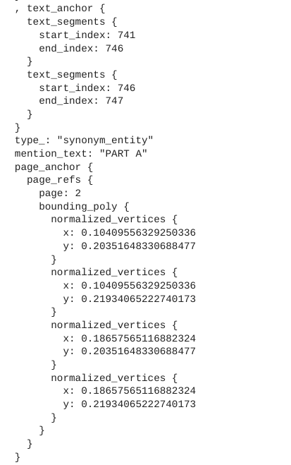
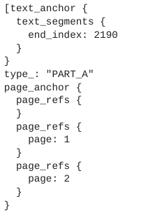
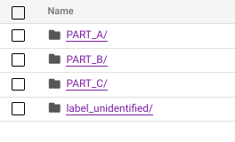
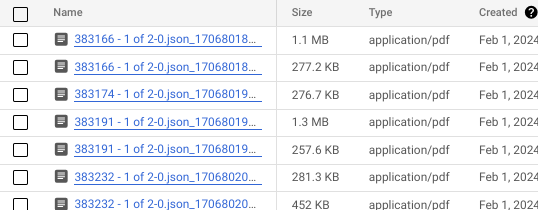

# Purpose and Description

The document will guide to label the documents which can be used by custom document splitter parser using synonyms list and OCR parsed jsons.
There is also an optional flag to split the pdfs and save into the GCS folders(named as labels).

Note:
If the synonyms are not unique or exists in more than one page then the synonym which is mentioned first in the list will
be considered and entity will be added by type found lowest index in the list'

EXAMPLE: synonyms_list=['PART A','PART B','PART C','PART D']

If PART A and PART B both are found in any of the pages then we consider the type of that page as PART A as
it has the lowest index in the list( FIRST element will be given priority as per code)

## Input Details
* **project_id** : Your Google project id or name
* **synonyms_list** : list of synonyms which has to be used to search in ocr for splitting documents
* **gcs_input_uri** : OCR PARSED JSONS RESULTS PATH
* **gcs_output_uri** : Path to save the updated jsons
* **save_split_pdfs_flag** : flag whether to save the splitted pdfs in gcs bucket
* **pdfs_ouput_path** : path to save the split files
* **synonym_entity_name** : type of entity to view in cde
* **label_unidentified_entity_name** : default label name in case first few pages no synonym found

## Output Details

Entities will be added to jsons and saved in the output gcs path

* CDE format entities with entity type as **synonym_entity** as shown below

</img>

* Splitter format entities added with entity type same as labels or synonyms given

</img>

* If save_split_pdfs_flag is TRUE , then the split pdfs will be saved in gcs path provided with folder names same as labels

</img>

If the documents doesnt have any synonyms given , then it will be saved in label_unidentified folder.

The names of files will be **filename+timestamp.pdf**

</img>
