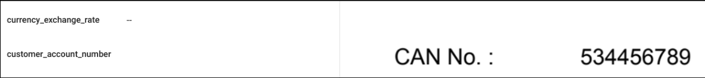
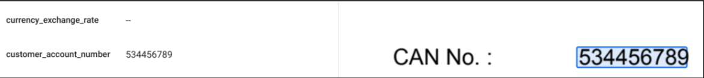

# Objective
The purpose of this post-processing script is to identify and tag the "customer_account_number" from OCR text, especially when the default invoice or pre-trained processor falls short.
The script is tailored to capture account numbers beginning with "5" or "05", comprising either 9 or 10 digits. It allows for modification to suit different pattern requirements or to identify new entities by adjusting the pattern and tagging them accordingly.

**NOTE:** If any other number is of the same pattern as of “customer_account_number”, then that also be tagged.

## Input Details
**input_path**: GCS Input Path. It should contain DocAI processed output json files.
**output_path**: GCS Output Path. The post-processed json files stored in this path.

**NOTE**: GCS path must ends-with trailing-slash (`/`)

## Output Details

The post processed json field can be found in the storage path provided by the user during the script execution that is **output_bucket**.

### Input Sample
</img>

### Output Sample
</img>