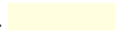
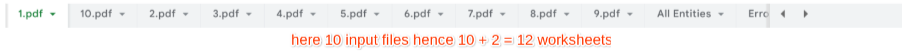
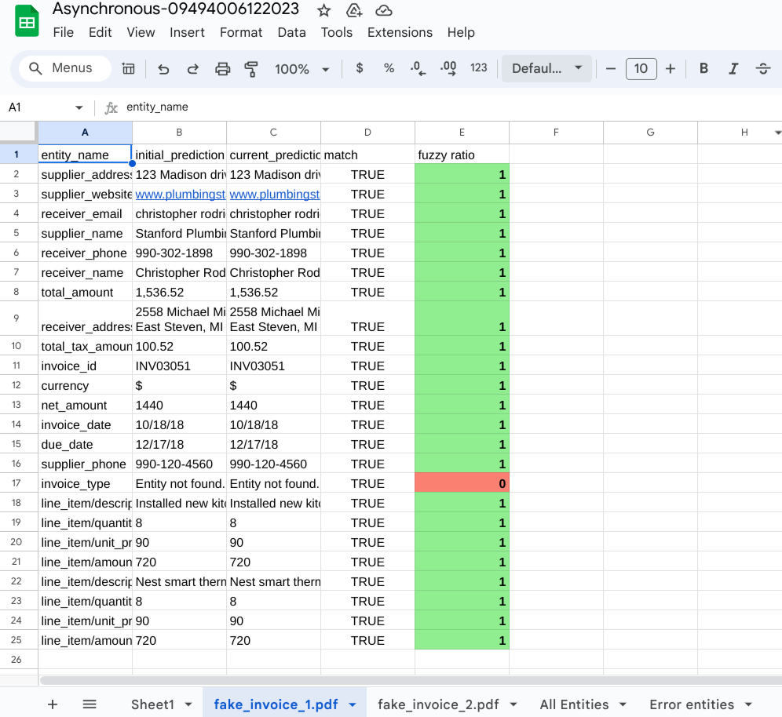

# Objective

In software testing, a test harness or automated test framework is a collection of software and test data configured to test a program unit by running it under varying conditions and monitoring its behavior and outputs.

The Test Harness tool is a useful tool to check:
* If the DocAI API is working properly or not and
* Check the differences between output of a parser in different time intervals.

This tool is designed to take a few documents from Google Cloud Storage (GCS) and parse them via a DocAI processor and compare the results to previously accepted results and then provide the output as a Google Sheet containing a report of entities matching percentage as well as fuzzy ratio.

Refer notebook for step-by-step procedure.

## Input Details
* **EMAIL_ADDRESS** : Enter the email address to which you wanted the comparison G-sheet to be sent.
* **API_KEY** :  Enter the path of Apikey json file like _example: /content/apikey.json_
* **PROCESS_TYPE** : Enter `a` or `s`, if you want to test the tool with a single document enter `s` else `a`.
* **PROJECT_NUMBER** :  Enter the google cloud project number.
* **PROJECT_NAME**: Enter the google cloud project name(this is required only when you run the code in google colab)
* **PROCESSOR_ID** : Enter the processor id from which you wanted to get the files to get parsed.
* **LOCATION** : Enter the Location(`us` or `eu`) of your processor chosen while creating.
* **INITIAL_JSON_BUCKET** : Enter the path to store the initial output json files when you run the tool with Mode I
* **MODE** : Enter the mode of test harness tool
  * **I** - Initial setup mode , this mode is to get the output jsons initially from a processor.
  * **C** - Comparison mode is for comparing output jsons which we have taken initially from mode `I` and output while testing the processor.
* **ASYNC_INPUT_BUCKET_PDFS** : Enter the path of documents to parse and compare
* **ASYNC_OUTPUT_BUCKET** : Enter the path where you wanted to store the output json files while using Mode `C` and Asynchronous mode.(required only in async mode and tool Mode `C`).
* **SYNC_INPUT_BUCKET_PDF** :  Enter the path of files for Tool mode `C` and Process mode `S` for a single file.(required only in sync mode and tool Mode `C`)
* **SYNC_INPUT_BUCKET_JSON** :  Enter the path of initial output json file to compare
* **PROCESSOR_VERSION_ID** : Enter the processor version ID for which you wanted to test.

## Output Details

### Synchronous Output
Sample Output file : **Synchronous**  
Explanation : In the Synchronous mode output should be be three worksheets ”fileName.pdf”, “All Entities” and “Error Entities”.  
 </img>  

In the “fileName.pdf” worksheet there are five columns named as “A:entity_name”, “B: initial_prediction”, “C:current_prediction”, “D:match” and  “E:fuzzy ratio”.

Here,
* “A:entity_name” represents the name of the entities present in both input and output json files.
* “B: initial_prediction” represents the data associated with the entity in file 1 (i.e json file generated using docAI API).
* “C:current_prediction” represents the data associated with corresponding entity in file 2 (i.e previously accepted result json file).
* “D:match” shows boolean values (i.e True of False) where True means the the value is exactly same as it was in the previously accepted result and false means there is some mismatch between the data in entity.
* “E:fuzzy ratio” gives a number between 0 to 1 which tells that if an entity was present in both of the files but still there is some difference in data then how much that difference is. Column “E” also shows three possible colors.

The color coding is defined to show the clear difference between two schemas:  
* Green→ </img>→ Entity matches in both files more than 75%.
* Yellow→ </img>→Entity matches in both files from 51% to 75%.
* Pink→ </img>→Entity matching percentage is below 51%.

Next worksheet “All Entities” is the report of total entities of various types out of which how many were not captured and how many were captured but with a slight change.

The last worksheet is “Error Entities”  which contains a list of all entities which have some issues and what is wrong with it. It has five columns representing “ input file name”, “ name of entity”, “ value in file 1”, “ value in file 2” and “matching score”. In the last column  color coding is also there as we’ve used above.

### Asynchronous Output
Sample Output file : **Asynchronous-14224306092022**
Explanation : If there are N numbers of input file should be N+2 worksheets in the output file.
 </img>  
<!--    -->
Similar to synchronous mode, in asynchronous mode output should be N + 2 worksheets, N worksheets labeled as  ”fileName.pdf”, “All Entities” and “Error Entities”.

### Output Color Coding Sample
</img>