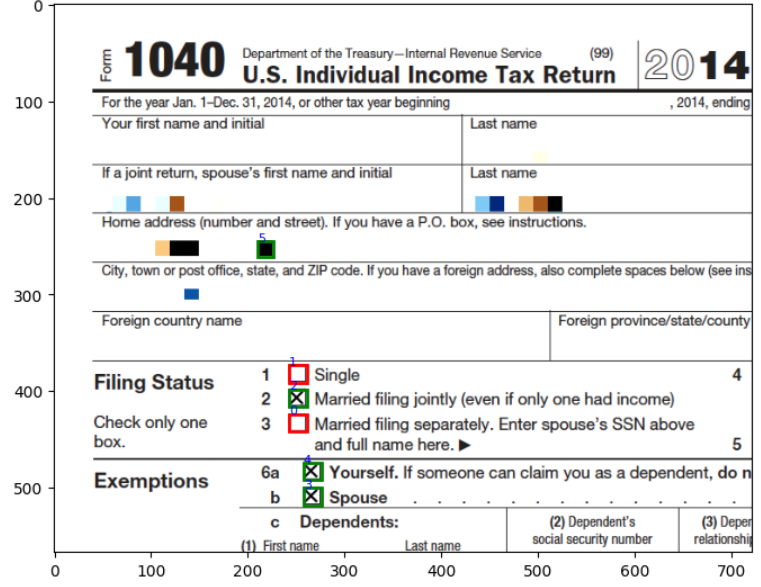

# Vertex Object Detection Visualization

## Objective

This code facilitates sending an image to a specified Vertex object detection model, processes the received predictions, and can also visualize the detected objects by overlapping bounding boxes and class labels on the original image. The results are then displayed, showcasing the model's detection capabilities.

## Prerequisites

* Python : Jupyter notebook (Vertex) or Google Colab
* Access to Vertex Model Endpoint
* Permissions, reference or access to Google projects are needed.
* Sample Images

### Setup the Required Inputs

* **project_id** : "your_project_id"  # Assign your Google Cloud project ID
* **endpoint_id** : "your_endpoint_id"  # Assign the ID of the AI Platform endpoint
* **location** : "your_location"  # Assign the location of the AI Platform endpoint (e.g., "us-central1")
* **model_signature_has_key** : True  # Set to True if the model signature includes a key, otherwise False
* **score_threshold** : 0.75  # Set the threshold for displaying detections (e.g., 0.75)
* **file_path** : "path/to/your/image.png"  # Specify the file path to your image

### Output

