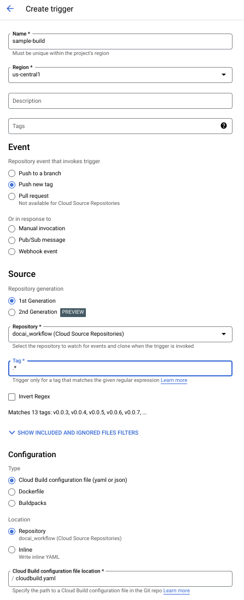

# Automate Parsing Tax Documents (1120-sc and 1040-c) with a Document AI Workflow
## Overview
This demo contains example code and instructions that show you how to use Document AI to check the quality and format of user uploaded documents, classify the document type as either 1040sc, 1120s or other, parse the respective document types, and then upload the processed and extracted document to Cloud Storage, BigQuery, and then publish to PubSub. Furthermore this repository contains example code and instructions to show you how to use Cloud Source Repositories and Google Cloud Build to automatically deploy changes upon code check-in. For more information, see [Demo Guide](https://docs.google.com/document/d/1_O0opWbK0uDpapDiumM75z9tgW01r4p3EdRtCMI5n1g/preview?rm=demo).

## Architecture Walkthrough
The below diagram details the workflow the code in this demo is based on. When a user uploads a document to the designated Google Cloud Storage bucket, it triggers the Cloud Function that contains the Document AI processors. First the code checks whether the uploaded file is an [acceptable file type](https://cloud.google.com/document-ai/docs/file-types). If it is not an accepted file type, the document is sent to a rejected documents Cloud Storage Bucket. If it is an accepted file type, then the Document AI Quality processor determines the quality of the document. If the document quality is not above the specified threshold, then a message is pushed to a PubSub topic for user review. If it is above the quality threshold, then the Document AI Splitter/Classifier processor identifies the document types. If the documents do not match with a known form parser, they should be handled as the user sees fit. If the documents can be classified to a known form parser, they are moved to their respective input Cloud Storage Buckets. The documents are then parsed with their respective parsers (1040-C Parser or 1120S Parser) and formatted into proper JSON structure. The processed, parsed, and formatted document is copied to the specified BQ table and their respective processed GCS buckets, as well as published to a PubSub topic that can be used to respond to the user, make a calculation or IQ.

## Demo Architecture


Designed to work with the following processors:

- [1040-C Parser](https://cloud.google.com/document-ai/docs/processors-list#processor_1040-schedule-c-parser) `FORM_1040SCH_C_PROCESSOR`
- [1120S Parser](https://cloud.google.com/document-ai/docs/processors-list#processor_1120s-parser) `FORM_1120S_PROCESSOR`
- [Document Quality](https://cloud.google.com/document-ai/docs/processors-list#processor_doc-quality-processor) `DOCUMENT_QUALITY_PROCESSOR`
- [Lending Doc Splitter/Classifier](https://cloud.google.com/document-ai/docs/processors-list#processor_lending-splitter-classifier) `LENDING_DOCUMENT_SPLIT_PROCESSOR`

For more information about Document AI Processors, check out [Full Processor and Detail List](https://cloud.google.com/document-ai/docs/processors-list#processor_doc-quality-processor)

By using this example you will learn how to:
1. Create a new repository in Cloud Source Repositories and clone it to your machine.
1. Set up the Google Cloud environment
1. Set up your local environment for development and testing
1. Create a Google Cloud Build Trigger with Cloud Source Repositories
1. Deploy Document AI Code as a Cloud Function
1. Deploy New Versions of the Cloud Function/Document AI code
 

## 1. Create a new repository in Cloud Source Repositories
You'll start by creating a new repository in Cloud Source Repositories (CSR), copying the files in this example into the CSR repository, and 
committing them to your new repository.

1. Go to [https://source.cloud.google.com/](https://source.cloud.google.com/).
1. Click 'Add repository'.
1. Choose 'Create new repository'.
1. Specify a name, and your project name.
1. Follow the instructions to 'git clone' the empty repository to your workstation.
1. Copy the files from this demo repository in [Gitlab](https://gitlab.com/caseynjustus/docai-tax-workflow-demo.git) into your new repository.
1. Add the files to the new repository with the command:
    ```bash
    git add .
    ```
1. Commit and push these files in the new repository by running the commands:
    ```bash
    git commit -m 'Creating a repository for Python Document AI and Cloud Build example.'
    git push origin master
    ```

You can alternatively do the same using the Google Cloud SDK:
1. Choose a name for your source repository and configure an environment variable for that name with the command:
    ```bash
    export REPO_NAME = <YOUR_REPO_NAME>
    ```
1. Create the repository by running the command:
     ```bash
     gcloud source repos create $REPO_NAME
     ```
1. Clone the new repository to your local machine by running the command: 
     ```bash
     gcloud source repos clone $REPO_NAME.
     ```
1. Copy the files from this example into the new repo.
1. Add the files to the new repository with the command:
    ```bash
    git add .
    ```
1. Commit and push these files in the new repository by running the commands:
    ```bash
    git commit -m 'Creating repository for Python Document AI demo.'
    git push origin master
    ```

## 2. Set up your Google Cloud Environment
You will need to set up your Google Cloud infrastructure so that you can execute this workload.
1. Navigate to the Project specified in step 1.
1. Create [Google Cloud Storage Buckets](https://cloud.google.com/storage/docs/creating-buckets). You will need:
    - 1 Original Input Bucket: bucket that the documents are initially uploaded to, which will trigger the workflow
    - 1 1040c input Bucket: bucket to move documents in original format to then be processed
    - 1 1120s input Bucket: bucket to move documents in original format to then be processed
    - 1 1040c output Bucket: bucket for the final processed 1040c documents to be copied to
    - 1 1120s output Bucket: for the final processed 1120s documents to be copied to
    - 1 Rejected Bucket: bucket for Rejected documents based on quality 
1. Create a [BigQuery dataset](https://cloud.google.com/bigquery/docs/datasets) and a [BigQuery table](https://cloud.google.com/bigquery/docs/tables) to write the formatted and processed documents to
1. Create a Pub/Sub [Topic](https://cloud.google.com/pubsub/docs/create-topic) and [Subscription](https://cloud.google.com/pubsub/docs/create-subscription) for the approved processed documents.
1. Create a Pub/Sub [Topic](https://cloud.google.com/pubsub/docs/create-topic) and [Subscription](https://cloud.google.com/pubsub/docs/create-subscription) for the processed documents that need to undergo human review.
1. Enable APIs needed for demo by running this script:
    ```
    gcloud services enable pubsub.googleapis.com logging.googleapis.com cloudbuild.googleapis.com documentai.googleapis.com
    ```
1. Go to Processor Gallery and create the following processors:
Note: - When you are viewing each processor details, take note of the processor ID. The respective processor ID's will be stored as variables later.

- 1040-C Parser:
    - Click Create Processor
    - Processor name: loan_workshop_1040c_parser
    - Region: US
    - Click Create Button
- 1120S parser
    - Click Create Processor
    - Processor name: loan_workshop_1120sk1_parser
    - Region: US
    - Click Create Processor
- Lending Doc Splitter/Classifier
    - Click Create Processor
    - Processor name: loan_workshop_classifier
    - Region: US
    - Click Create Processor
- Document Quality
    - Click Create Processor
    - Processor name: loan_workshop_doc_quality
    - Region: US
    - Click Create Processor

8. Now, you must update the env.yaml file with your respective GCP environment variables. This is very important, make sure not to skip this step! 


## 3. Set up your local environment for development and testing (optional)
Step 3 details how to set up your local environment to run and test locally, you can still run the demo in your cloud environment without doing this step.
1. [Install Python](https://www.python.org/downloads/)
1. Install the [Google Cloud SDK](https://cloud.google.com/sdk/docs/install)
1. Create a virtual environment. This only needs to be done ONE TIME for the project. Do not create more than one virtual environment for a project. In this example the virtual environment is named 'venv', but you can name it anything. Add the virtual environment to the .gitignore file so that you never check in the virtual environment to Cloud Source Repositories. 
    ```bash
    python3 -m venv venv
    ```
1. Activate the virtual environment. Make sure the environment is activated whenever you try to run the code. You will see (venv) in your terminal.
    ```bash
    source venv/bin/activate
    ```
1. Authentication. Use gcloud to authenticate locally.
    ```bash
    gcloud init
    gcloud auth application-default login
    ```
1. Replace variable names in the variables.sh file. This will change based on how you set up your cloud environment.
1. Source the variables to your environment.
    ```bash
    source quality_and_split/variables.sh
    ```

1. Navigate to the root of the repo: 
    ```bash
    cd ./quality_and_split/
    ```
1. Copy and paste above export commands to save variables to your local environment
1. Install the prerequisites (make sure step 4 is completed): 
    ```bash
    pip install -r requirements.txt
    ```
1. Run the code locally: 
    ```bash
    python3 ./main.py
    ```

Based on the documents uploaded your output will change. If you successfully uploaded a 1040C document, your output should look similar to this:

```bash
    Found content type:application/pdf
    File f1040sc--2021_filledin-test.pdf blob extracted from lending-app-doc-original.
    Entities extracted from DocAI using processor projects/619323487229/locations/us/processors/f0d623e4284f4024.
    Average quality in document entities: 0.9350968599319458
    Entities extracted from DocAI using processor projects/619323487229/locations/us/processors/3cd27da14c954ee4.
    Entities extracted from DocAI using processor projects/619323487229/locations/us/processors/bf09b1a063ca8227.
    Formatted entities to a list.
    File 1040sc_2023-02-17_13:35:12_f1040sc--2021_filledin-test.pdf uploaded to 1040sc_2023-02-17_13:35:12_f1040sc--2021_filledin-test.pdf.
    BQ upload job results:LoadJob<project=docai-project, location=US, id=xxx>
    1040sc output has been written to BQ.
    Result of publishing to PubSub topic:6943268033253657
```    


You have now successfully run the source code locally.


## 4. Deploy Document AI Code as a Cloud Function
We want this process to be automated, so that when a user uploads a document, this code automatically runs and outputs as needed. In order to do this, we deploy this code as a Cloud Function.

Create the cloud function using the following command, substituting your environment variables in:

```bash
gcloud functions deploy function_name --runtime=python310 --entry-point=process_receipt --ingress-settings=internal-and-gclb --source=https://source.developers.google.com/projects/{PROJECT_ID}/repos/{REPOSITORY_ID}/moveable-aliases/{BRANCH_ID}/paths/{PATH} --trigger-bucket=<your trigger GCS bucket>
```
(Note that PROJECT_ID, REPOSITORY_ID, and BRANCH_ID can not contain '/'. PATH may contain '/')


<b> Alternatively</b>, create the Cloud Function in the Cloud Console following these steps:


1. Go to the [Cloud Functions Overview Page](https://cloud.google.com/functions/docs/deploy#console:~:text=Go%20to%20Cloud%20Functions) in the Google Cloud Console. Make sure the correct Google Cloud Project is selected
1. Click Create Function.
1. In the Environment field, select 1st gen. See [Cloud Functions version comparison](https://cloud.google.com/functions/docs/deploy#console:~:text=Cloud%20Functions%20version%20comparison) for a comparison.
1. Enter a Function name and select your intended region to deploy.
1. In the Trigger section, select the 'Cloud Storage' Trigger type. For event type, select 'On (finalizing/creating) file in the selected bucket'. Select the Bucket you created previously for document inputs. For demo purposes, leave 'Retry on failure' unchecked.
1. Under 'Runtime, build, connections and security settings', Click the Connections tab. Set the Ingress settings to 'Allow internal traffic and traffic from Cloud Load Balancing'.
1. Click Next. Select 'Python 3.10' Runtime. Under Source code, select 'Cloud Source Repository'. For Entry point, type 'process_receipt'
1. Under the Cloud Source repository section, input the following fields:
    - Project ID: Your unique Project ID
    - Repository: Your unique Repository name
    - Branch/Tag: branch
    - Branch name: main
    - Directory with source code: /quality_and_split
1. Click Deploy button
1. Go into cloudbuild.yaml file, and change the docai-demo-function argument to your function name. You can change other variables as well if you see fit.


## 5. Create a Google Cloud Build Trigger with Cloud Source Repositories
Now that you've created a Cloud Function to run your code, you 
should [create a Cloud Build Trigger](https://cloud.google.com/cloud-build/docs/running-builds/automate-builds) that starts deploying the build when a new tag is pushed to the Repository. To do that, follow these steps:

1. On the GCP console navigate to 'Cloud Build' > 'Triggers'.
1. Add a trigger by clicking '+ CREATE TRIGGER'.
1. Name your build and select the region you will be running your workflow in.
1. Add description or tags as needed.
1. Select 'Push new tag' as the Repository event to invoke the trigger
1. Choose the cloud source repository you created in step 1. from the 'Repository' drop down.
1. In the mandatory Tag field, type/select .*(any tag)
1. Leave other defaults
1. Choose the 'Cloud Build configuration file (yaml or json)' radio button  under 'Configuration'.
1. Under location, select repository 
1. Type 'cloudbuild.yaml' in the Cloud Build configuration file location *.
1. Click 'Create trigger'.

    See image for example: 

    


## 6. Deploying New Versions of the Cloud Function
The Primary benefit that comes with Cloud Build automation is that every time you update the cloud source repository with a new tag, Cloud Build is triggered and redeploys the Cloud Function with your code to match the new version. This section outlines how to deploy new versions from your IDE terminal.
1. When you make changes and save them, first commit your changes: `git commit -a -m "comment"`
1. Then tag these changes: `git tag -a v0.0.(Version number) -m "comment"`
1. Finally, push changes: 
    ```bash
    git push google v0.0.(version number)
    git push google HEAD
    ```

## 7. Test and Run Your New Code!
To run this new Document AI workflow you've just built, follow these instructions.
1. [Upload a file](https://cloud.google.com/storage/docs/uploading-objects#:~:text=Drag%20and%20drop%20the%20desired,that%20appears%2C%20and%20click%20Open.) of a 1040sc or 1120sk document to your input Google Cloud Storage Bucket. See resources directory for a sample file to upload.
1. Find the bucket for the final processed document of that type. Find the object named: `1040sc_YYYY-MM-DD_HH:MM:SS_previousfilename.pdf` or `1120sk_YYYY-MM-DD_HH:MM:SS_previousfilename.pdf`. 
1. Explore object to view the processed and formatted document.