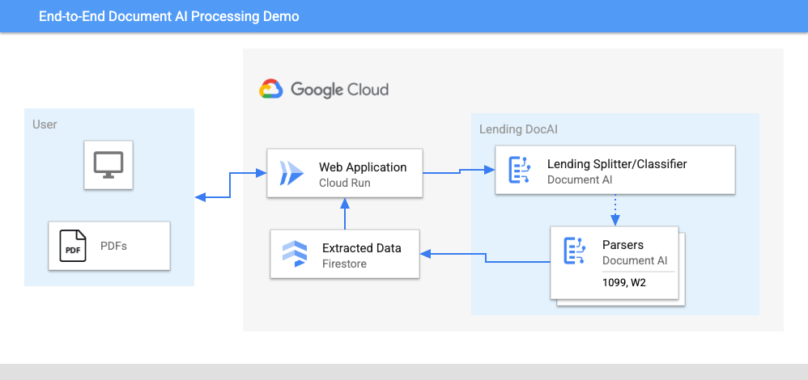
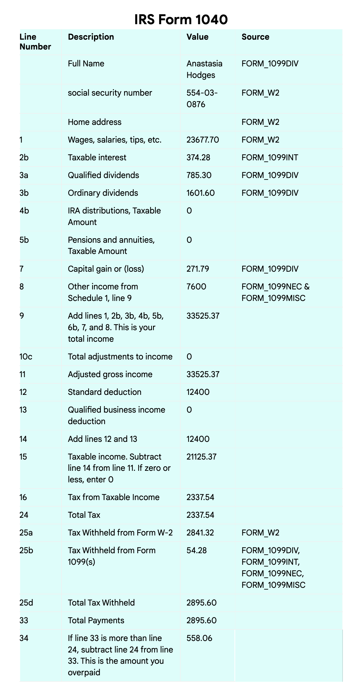

# Document AI Automated Pipeline Demo

This demo illustrates how to build a fully automated specialized document processing pipeline with Document AI.

For an example use case, the application is equipped to process an individual US Tax Return using the Lending Document AI Processors.

> NOTE: Most of the Processors in this Demo require allowlisting to use.  
> [Read More about Lending DocAI](https://cloud.google.com/solutions/lending-doc-ai)

## Architecture



### Processing Steps

- Document Classification
- Document Parsing
- Entity Extraction
- Data Storage
- Data Processing

### Google Cloud Products Used

- [Lending Document AI Processors][1]
  - `LDAI Splitter & Classifier`
  - `W-2 Parser`
  - `1099 Parser(s)`
- [Firestore][2] (Native Mode)
- [Cloud Run][3]

[1]: https://cloud.google.com/document-ai/docs/processors-list#lending_processors
[2]: https://cloud.google.com/firestore
[3]: https://cloud.google.com/run

## Setup

### Dependencies

1. [Install Python](https://www.python.org/downloads/)
2. Install the [Google Cloud SDK](https://cloud.google.com/sdk/docs/install)
3. Install the prerequisites:
   - `pip install -r requirements.txt`
4. Run `gcloud init`, create a new project, and
   [enable billing](https://cloud.google.com/billing/docs/how-to/modify-project#enable_billing_for_a_project)
5. Enable the Document AI API:
   - `gcloud services enable documentai.googleapis.com`
6. Setup application default authentication, run:
   - `gcloud auth application-default login`
7. Create a Firestore Database in Native Mode
   - `gcloud firestore databases create`

### Demo Deployment

1. Create a `config.yaml` with the following format

   ```yaml
   docai_processor_location: us # Document AI Processor Location (us OR eu)
   docai_project_id: YOUR_PROJECT_ID # Project ID for Document AI Processors
   firestore:
     collection: tax_documents # Set with your preferred Firestore Collection Name
     project_id: YOUR_PROJECT_ID # Project ID for Firestore Database
   docai_active_processors:
   ```

2. Run setup scripts to create the processors and Cloud Run app in your project.
   - `python3 setup.py`
   - `gcloud run deploy tax-demo --source .`
3. Visit the deployed web page
4. Upload Sample Documents
   - Currently supports the following Document Types (2020 Editions)
     - `W-2`
     - `1099-DIV`
     - `1099-INT`
     - `1099-MISC`
     - `1099-NEC`
5. Click "Upload" Button, wait for processing to complete
6. Click "View Saved Data" to see the tax calculation output
   - This output is designed to match up with the 2020 `1040` US Tax Return Form




> **WARNING: This is NOT financial advice, for educational purposes only!**

---

> Copyright 2022 Google LLC
> Author: Holt Skinner
