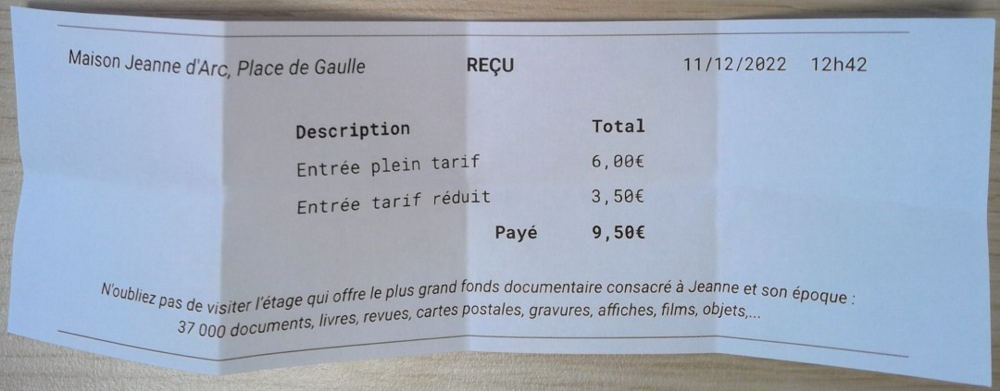

# From pixels to information with Document AI


We’re seeing successively difficult problems getting solved thanks to machine learning (ML) models. For example, [Natural Language AI](https://cloud.google.com/natural-language) and [Vision AI](https://cloud.google.com/vision) extract insights from text and images, with human-like results. They solve problems central to the way we communicate:

- ✅ Natural language processing (NLP)
- ✅ Optical character recognition (OCR)
- ✅ Handwriting recognition (HWR)

What's next? Well, it's already here, with [Document AI](https://cloud.google.com/document-ai), and keeps growing:

- ✅ Document understanding (DU)

Document AI builds on these foundations to let you extract information from documents, in many forms:

- Text
- Structure
- Semantic entities
- Normalized values
- Enrichments
- Qualitative signals

In this article, you’ll see the following:

- An overview of Document AI
- Practical and visual examples
- A document processing demo (source code included)

## Processing documents

### Processor types

There are as many document types as you can imagine so, to meet all needs, document processors are at the heart of Document AI. They can be of the following types:

- **General processors** handle common tasks such as detecting document tables or parsing forms.
- **Specialized processors** analyze specific documents such as invoices, receipts, pay slips, bank statements, identity documents, official forms, etc.
- **Custom processors** meet other specific needs, letting you automatically train private ML models based on your own documents, and perform tasks such as custom document classification or custom entity detection.

### Processor locations

When you create a processor, you specify its location. This helps control where the documents will be processed. Here are the current multi-region locations:

| Location       | API `location` | API endpoint                   |
| -------------- | -------------- | ------------------------------ |
| European Union | `eu`           | `eu-documentai.googleapis.com` |
| United States  | `us`           | `us-documentai.googleapis.com` |

In addition, some processors are available in single-region locations; this lets you address local regulation requirements. If you regularly process documents in real-time or large batches of documents, this can also help get responses with even lower latencies. As an example, here are the current locations for the "Document OCR" general processor:

| `OCR_PROCESSOR` location | API `location`            |
| ------------------------ | ------------------------- |
| United States            | `us`                      |
| European Union           | `eu`                      |
| India (Mumbai)           | `asia-south1`             |
| Singapore (Jurong West)  | `asia-southeast1`         |
| Australia (Sydney)       | `australia-southeast1`    |
| England (London)         | `europe-west2`            |
| Germany (Frankfurt)      | `europe-west3`            |
| Québec (Montréal)        | `northamerica-northeast1` |

Note: API endpoints are named according to the convention `{location}-documentai.googleapis.com`.

For more information, check out [Regional and multi-regional support](https://cloud.google.com/document-ai/docs/regions).

### Processor versions

Processors can evolve over time, to offer more precise results, new features, or fixes. For example, here are the current versions available for the "Expense Parser" specialized processor:

| `name`                             | `display_name`    | `create_time` |
| ---------------------------------- | ----------------- | ------------- |
| pretrained-expense-v1.1-2021-04-09 | Stable            | 2021-04-09    |
| pretrained-expense-v1.2-2022-02-18 | Stable            | 2022-02-18    |
| pretrained-expense-v1.3-2022-07-15 | Stable            | 2022-07-15    |
| pretrained-expense-v1.4-2022-11-18 | Release Candidate | 2022-11-18    |

You may typically do the following:

- Use `Stable` version `1.3` in production.
- Use `Release Candidate` version `1.4` to benefit from new features or test a future version.

To stay updated, follow the [Release notes](https://cloud.google.com/document-ai/docs/release-notes).

### Interfaces

Document AI is available to developers and practitioners through the usual interfaces:

- [REST API](https://cloud.google.com/document-ai/docs/reference/rest) (universal JSON-based interface)
- [RPC API](https://cloud.google.com/document-ai/docs/reference/rpc) (low-latency gRPC interface, used by all Google services)
- [Client Libraries](https://cloud.google.com/document-ai/docs/quickstart-client-libraries#install_the_client_library) (gRPC wrappers, to develop in your preferred programming language)
- [Cloud Console](https://console.cloud.google.com/ai/document-ai) (web admin user interface)

### Requests

There are two ways you can process documents:

- **Synchronously** with online requests, to analyze a single document and directly use the results
- **Asynchronously** with batch requests, to launch a batch processing operation on multiple or larger documents

| Interface               | Synchronous method | Asynchronous method       |
| ----------------------- | ------------------ | ------------------------- |
| REST                    | `process`          | `batchProcess`            |
| RPC                     | `ProcessDocument`  | `BatchProcessDocuments`   |
| Client library: Python  | `process_document` | `batch_process_documents` |
| Client library: Node.js | `processDocument`  | `batchProcessDocuments`   |
| Client library: Java,…  | …                  | …                         |

## Extracting information from pixels

Let's start by analyzing this simple screenshot with the "Document OCR" general processor, and check how pixels become structured data.

**Input image**


**Document AI response**

- The response contains a `Document` instance.
- The entire text of the input, detected in natural reading order, is serialized under `Document.text`.
- The structured data is returned on a per page basis (a single page here).
- The "Document OCR" processor returns a structural skeleton common to all processors.

```jsonc
{ // document
  "mime_type": "image/png",
  "text": "Willkommen!\nBienvenue !\nWelcome!\nQuestion: What is the answer to the ultimate question of life?\nAnswer: 42\n",
  "pages": [
    {
      "page_number": 1,
      "dimension": {/*…*/},
      "layout": {/*…*/},
      "detected_languages": [/*…*/],
      "blocks": [/*…*/],
      "paragraphs": [/*…*/],
      "lines": [/*…*/],
      "tokens": [/*…*/],
      "image": {/*…*/}
    }
  ]
}
```

The examples in this article show snake-case field names (like `mime_type`), using the convention used by gRPC and programming languages like Python. For camel-case environments (like REST/JSON), there is a direct mapping between the two conventions:

- `mime_type` ↔ `mimeType`
- `page_number` ↔ `pageNumber`
- …

## Text levels

For each page, four levels of text detection are returned:

- `blocks`
- `paragraphs`
- `lines`
- `tokens`

In these lists, each item exposes a `layout` including the item's position relative to the page in `bounding_poly.normalized_vertices`.

This lets us, for example, highlight the 22 detected tokens:


Here is the last token:

```jsonc
{ // document.pages[0].tokens[21]
  "layout": {
    "text_anchor": {
      // "42\n" ← document.text[104:107]
      "text_segments": [{ "start_index": "104", "end_index": "107" }]
    },
    "confidence": 0.99, // Confident at 99% that the answer is "42" ;)
    "bounding_poly": {
      // The 4 bounding box vertices, relative to the page
      // Page (top, left)..(bottom, right): (0.0, 0.0)..(1.0, 1.0)
      "normalized_vertices": [ { "x": 0.4028, "y": 0.5352 },
                               { "x": 0.4327, "y": 0.5352 },
                               { "x": 0.4327, "y": 0.6056 },
                               { "x": 0.4028, "y": 0.6056 } ]
    } //,…
  } //,…
}
```

Note: Float values are presented truncated for the sake of readability.

## Language support

Documents are often written using one single language, but sometimes use multiple languages. You can retrieve the detected languages at different text levels.

In our previous example, two blocks are detected (`pages[0].blocks[]`). Let's highlight them:


The left block is a mix of German, French, and English, while the right block is English only. Here is how the three languages are reported at the page level:

```jsonc
{ // document.pages[0]
  "detected_languages": [
    { "language_code": "en", "confidence": 0.77 },
    { "language_code": "de", "confidence": 0.12 },
    { "language_code": "fr", "confidence": 0.11 }
  ]
}
```

Note: At this level, the language confidence ratios roughly correspond to the proportion of text detected in each language.

Now, let's highlight the five detected lines (`pages[0].lines[]`):


Each language is also reported at the line level:

```jsonc
{ // document.pages[0]
  "lines": [
    // "Willkommen!"
    { "detected_languages": [{ "language_code": "de", "confidence": 1.0 }] },
    // "Bienvenue !"
    { "detected_languages": [{ "language_code": "fr", "confidence": 1.0 }] },
    // "Welcome!"
    { "detected_languages": [{ "language_code": "en", "confidence": 1.0 }] },
    // "Question: What is the answer to the ultimate question of life?"
    { "detected_languages": [{ "language_code": "en", "confidence": 1.0 }] },
    // "Answer: 42"
    { "detected_languages": [{ "language_code": "en", "confidence": 1.0 }] }
  ]
}
```

If needed, you can get language info at the token level too. "Question" is the same word in French and in English, and is adequately returned as an English token in this context:

```jsonc
{ // document.pages[0].tokens[6]
  "layout": {
    "text_anchor": {
      // "Question" ← document.text[33:41]
      "text_segments": [{ "start_index": "33", "end_index": "41" }]
    },
    "confidence": 0.99
  },
  // In this context, the token "Question" is English, not French
  "detected_languages": [{ "language_code": "en" }]
}
```

In the screenshot, did you notice something peculiar in the left block?


Well, punctuation rules can be different between languages. French uses a typographical space for double punctuation marks ("double" as "written in two parts", such as in `"!"`, `"?"`, `"«"`,…). Punctuation is an important part of languages that can get "lost in translation". Here, the space is preserved in the transcription of `"Bienvenue !"`. Nice touch Document AI or, should I say, touché!

```jsonc
{ // document.pages[0].lines[1]
  "layout": {
    "text_anchor": {
      "text_segments": [
        // "Bienvenue !\n" ← document.text[12:24]
        // The French typographical space before "!" is preserved \o/
        { "start_index": "12", "end_index": "24" }
      ]
    },
    "confidence": 0.99
  }
}
```

For more information, see [Language support](https://cloud.google.com/document-ai/docs/languages).

## Handwriting detection

Now — a much harder problem — let's check how handwriting is handled.

This example is a mix of printed and handwritten text, where I wrote both a question and an answer. Here are the detected tokens:


I am pleasantly surprised to see my own handwriting transcribed:

```jsonc
{ // document
  "text": "Willkommen!\nBienvenue !\nWelcome!\nQuestion: What is the answer to the ultimate question of life?\nAnswer:\n42\n"
}
```

I asked my family (used to writing French) to do the same. Each unique handwriting sample also gets correctly detected:


… and transcribed:

```jsonc
{ // document
  "text": [
    "Willkommen!\nBienvenue !\nWelcome!\n",
    "Willkommen!\nBienvenue !\nWelcome!\n",
    "Willkommen!\nBienvenue !\nWelcome!\n",
    "Willkommen!\nBienvenue !\nWelcome!\n",
    "Question: What is the answer to the ultimate question of life?\nAnswer: 42\n",
    "Question: What is the answer to the ultimate question of life?\nAnswer: 42\n",
    "Question: What is the answer to the ultimate question of life?\nAnswer: 42\n",
    "Question: What is the answer to the ultimate question of life?\nAnswer: 42\n"
  ]
}
```

This can look magical but that's one of the goals of ML models: return results as close as possible to human responses.

## Confidence scores

We make mistakes, and so can ML models. To better appreciate the structured data you get, results include confidence scores:

- Confidence scores do not represent accuracy.
- They represent how confident the model is with the extracted results.
- They let you — and your users — ponder the model’s extractions.

Let's overlay confidence scores on top of the previous example:


After grouping them in buckets, confidence scores appear to be generally high, with a few outliers:


The lowest confidence score here is 57%. It corresponds to a handwritten word (token) that is both short (less context given for confidence) and not particularly legible indeed:

```jsonc
{ // document.pages[0].tokens[71].layout
  "text_anchor": {
    // "42\n" ← document.text[351:354]
    "text_segments": [ { "start_index": "351", "end_index": "354" } ]
  },
  // 57% ← Confidence that this token is "42"
  "confidence": 0.57
}
```

For best results, keep in mind these general rules of thumb:

- ML results are best guesses, which can be correct or incorrect.
- Results with lower confidence scores are more likely to be incorrect guesses.
- If we can't smoothly read a part of a document, or need to think twice about it, it's probably also harder for the ML model.

Although all text is correctly transcribed in the presented examples, this won't always be the case depending on the input document. To build safer solutions — especially with critical business applications — you may consider the following:

- Be clear with your users that results are auto-generated.
- Communicate the scope and limitations of your solution.
- Improve the user experience with interpretable information or filterable results.
- Design your processes to trigger human intervention on lower confidence scores.
- Monitor your solution to detect changes over time (drift of stable metrics, decline in user satisfaction, etc.).

To learn more about AI principles and best practices, check out [Responsible AI practices](https://ai.google/responsibilities/responsible-ai-practices).

## Rotation, skew, distortion

How many times did you scan a document upside down by mistake? Well, this shouldn't be a concern anymore. Text detection is very robust to rotation, skew, and other distortions.

In this example, the webcam input is not only upside down but also skewed, blurry, and with text in unusual orientations:


Before further analysis, Document AI considers the best reading orientation, at the page level, and preprocesses (deskews) each page if needed. This gives you results that can be used and visualized in a more natural way. Once processed by Document AI, the preceding example gets easier to read, without straining your neck:


In the results, each page has an `image` field by default. This represents the image — deskewed if needed — used by Document AI to extract information. All the page results and coordinates are relative to this image. When a page has been deskewed, a `transforms` element is present and contains the list of transformation matrices applied to the image:

```jsonc
{ // document.page[0]
  // The image for the page. All coordinates are relative to this image.
  "image": { "content": "…", "mime_type": "image/png", "width": 1150 /*…*/ },
  // 1 transformation matrix was applied to deskew the page
  "transforms": [ { "rows": 2, "cols": 3 /*…*/ } ]
}
```

Notes:

- Page images can be in different formats. For instance, if your input is a JPEG image, the response will include either the same JPEG or a deskewed PNG (as in the earlier example).
- Deskewed images have larger dimensions (deskewing adds blank outer areas).
- If you don't need visual results in your solution, you can specify a `field_mask` in your request to receive lighter responses, with only your fields of interest.

## Orientation

Documents don't always have all of their text in a single orientation, in which case deskewing alone is not enough. In this example, the sentence is broken out in four different orientations. Each part gets properly recognized and processed in its natural orientation:


Orientations are reported in the `layout` field:

```jsonc
[ // document.pages[0].blocks
  { "layout": { "orientation": "PAGE_RIGHT" } }, // → 90° clockwise
  { "layout": { "orientation": "PAGE_UP" } },    // ↑ Natural orientation
  { "layout": { "orientation": "PAGE_LEFT" } },  // ← 90° counterclockwise
  { "layout": { "orientation": "PAGE_DOWN" } }   // ↓ 180° from upright
]
```

Note: Orientations are returned at each OCR level (`blocks`, `paragraphs`, `lines`, and `tokens`).

## Noise

When documents come from our analog world, you can expect … the unexpected. As ML models are trained from real-world samples — containing real-life noise — a very interesting outcome is that Document AI is also significantly robust to noise.

In this example with crumpled paper, the text starts to be difficult to read but still gets correctly transcribed by the OCR model:


Documents can also be dirty or stained. With the same sample, this keeps working after adding some layers of noise:


In both cases, the exact same text is correctly detected:

```jsonc
{ // document
  "text": "Coffee\nCoffee is a brewed beverage made from particular beans. Arthur Dent made himself some coffee on the\nThursday of Earth's destruction; this behaviour was most unusual, as he usually drank tea.\n"
}
```

You've seen most core features. They are supported by the "Document OCR" general processor as well as the other processors, which leverage these features to focus on more specific document types and provide additional information. Let's check the next-level processor: the "Form Parser" processor.

## Form fields

The "Form Parser" processor lets you detect form fields. A form field is the combination of a field name and a field value, also called a key-value pair.

In this example, printed and handwritten text is detected as seen before:


In addition, the form parser returns a list of `form_fields`:

```jsonc
{ // document
  "text": "My name:\nDEEP THOUGHT\nYour question: What is the answer to the ultimate question?\nMy answer:\n42\n",
  "pages": [
    {
      "page_number": 1,
      "dimension": {/*…*/},
      "layout": {/*…*/},
      "detected_languages": [/*…*/],
      "blocks": [/*…*/],
      "paragraphs": [/*…*/],
      "lines": [/*…*/],
      "tokens": [/*…*/],
      "form_fields": [/* NEW */],
      "image": {/*…*/}
    }
  ]
}
```

Here is how the detected key-value pairs are returned:

```jsonc
{ // document.pages[0]
  "form_fields": [
    { // "My name:\n"
      "field_name":  { "text_anchor": {/*…*/}, "confidence": 0.96 /*,…*/ },
      // "DEEP THOUGHT\n"
      "field_value": { "text_anchor": {/*…*/}, "confidence": 0.96 /*,…*/ }
    },
    { // "Your question: "
      "field_name":  { "text_anchor": {/*…*/}, "confidence": 0.98 /*,…*/ },
      // "What is the answer to the ultimate question?\n"
      "field_value": { "text_anchor": {/*…*/}, "confidence": 0.98 /*,…*/ }
    },
    { // "My answer:\n"
      "field_name":  { "text_anchor": {/*…*/}, "confidence": 0.76 /*,…*/ },
      // "42\n"
      "field_value": { "text_anchor": {/*…*/}, "confidence": 0.76 /*,…*/ }
    }
  ]
}
```

And here are their detected bounding boxes:


Note: Form fields can follow flexible layouts. In this example, keys and values are in a left-right order. You'll see a right-left example next. Those are just simple arbitrary examples. It also works with vertical or free layouts where keys and values are logically (visually) related.

## Checkboxes

The form parser also detects checkboxes. A checkbox is actually a particular form field value.

This example is a French exam with affirmations that should be checked when exact. To test this, I used checkboxes of different kinds, printed or handmade. All form fields are detected, with the affirmations as field names and the corresponding checkboxes as field values:


When a checkbox is detected, the form field contains an additional `value_type` field, which value is either `unfilled_checkbox` or `filled_checkbox`:

```jsonc
{ // document.pages[0]
  "form_fields": [
    { // [ ] Les cyclines se lient aux CDK…
      "field_name": {/*…*/},
      "field_value": {/*…*/},
      "value_type": "unfilled_checkbox"
    },
    { // [x] Les mutations peuvent être provoquées…
      "field_name": {/*…*/},
      "field_value": {/*…*/},
      "value_type": "filled_checkbox"
    } //,…
  ]
}
```

Being able to analyze forms can lead to huge time savings, by consolidating — or even autoprocessing — content for you.
The preceding checkbox detection example was actually an evolution of a prior experiment to autocorrect my wife's pile of exam copies.
The proof of concept got better using checkboxes, but was already conclusive enough with True/False handwritten answers. Here is how it can autocorrect and autograde:


## Tables

The form parser can also detect another important structural element: tables.

In this example, words are presented in a tabular layout without any borders. The form parser finds a table very close to the (hidden) layout. Here are the detected cells:


In this other example, some cells are filled with text while others are blank. There are enough signals for the form parser to detect a tabular structure:


When tables are detected, the form parser returns a list of `tables` with their rows and cells. Here is how the table is returned:

```jsonc
{ // document.pages[0]
  "tables": [{
      "layout": {/*…*/},
      "header_rows": [{
        // | ALPHA |       |     |     | EPSILON |     | ETA |       |
        "cells": [/*…*/]
      }],
      "body_rows": [{
        // |       | KAPPA |     | MU  |         | XI  |     | PI    |
        "cells": [/*…*/]
      },
      {
        // | RHO   |       | TAU |     | PHI     |     |     | OMEGA |
        "cells": [/*…*/]
      }]
  }]
}
```

And here is the first cell:

```jsonc
{ // document.pages[0].tables[0].header_rows[0].cells[0]
  "layout": {
    // ALPHA\n
    "text_anchor": {/*…*/},
    "confidence": 0.9979,
    "bounding_poly": {/*…*/},
    "orientation": "PAGE_UP"
  },
  "row_span": 1,
  "col_span": 1
}
```

## Specialized processors

Specialized processors focus on domain-specific documents and extract **entities**. They cover many different document types that can currently be classified in the following families:

- **Procurement** — receipts, invoices, utility bills, purchase orders,…
- **Lending** — bank statements, pay slips, official forms,…
- **Identity** — national IDs, driver licenses, passports,…
- **Contract** — legal agreements

For example, procurement processors typically detect the `total_amount` and `currency` entities:

```jsonc
{ // document
  "entities": [
    {
      "text_anchor": {/*…*/},
      "type_": "total_amount",
      "mention_text": "15",
      "confidence": 0.96,
      "page_anchor": {/*…*/},
      "id": "0"
    },
    {
      "text_anchor": {/*…*/},
      "type_": "currency",
      "mention_text": "USD",
      "confidence": 0.95,
      "page_anchor": {/*…*/},
      "id": "1"
    }
  ]
}
```

For more information, check out [Fields detected](https://cloud.google.com/document-ai/docs/fields).

## Expenses

The "Expense Parser" lets you process receipts of various types. Let's analyze this actual (French) receipt:


A few remarks:

- All expected entities are extracted.
- Ideally (to be picky), I'd like to get the tax rate too. If there's customer demand for it, this may be a supported entity in a future version.
- Due to the receipt's very thin paper, the text on the back side is visible by transparency (another type of noise).
- The supplier name is wrong (it's actually mirrored text from the back side) but with a very low confidence (4%). You'd typically handle it with special care (it's shown differently here) or ignore it.
- The actual supplier info is hidden (the top part of the receipt is folded) on purpose. You'll see another example with supplier data a bit later.
- Receipts are often printed on single (sometimes on multiple) pages. The expense parser supports analyzing expense documents of up to 10 pages.

Procurement documents often list parts of the data in tabular layouts. Here, they're returned as many `line_item/*` entities. When the entities are detected as part of a hierarchical structure, the results are nested in the `properties` field of a parent entity, providing an additional level of information. Here's an excerpt:

```jsonc
{ // document.entities[7]
  "text_anchor": {/*…*/},
  "type_": "line_item",
  "mention_text": "*BANANE BIO 1.99",
  "confidence": 1.0,
  "page_anchor": {/*…*/},
  "id": "9",
  "properties": [
    {
      "text_anchor": {/*…*/},
      "type_": "line_item/description",
      "mention_text": "*BANANE BIO",
      "confidence": 0.54613465,
      "page_anchor": {/*…*/},
      "id": "10"
    },
    {
      "text_anchor": {/*…*/},
      "type_": "line_item/amount",
      "mention_text": "1.99",
      "confidence": 0.36692643,
      "page_anchor": {/*…*/},
      "id": "11"
    }
  ]
}
```

For more information, see the [Expense Parser](https://cloud.google.com/document-ai/docs/processors-list#processor_expense-parser) details.

## Entity normalization

Getting results is generally not enough. Results often need to be handled in a post-processing stage, which can be both time consuming and a source of errors. To address this, specialized processors also return normalized values when possible. This lets you directly use standard values consolidated from the context of the whole document.

Let's check it with this other receipt:



First, the receipt currency is returned with its standard code under `normalized_value`:

```jsonc
{ // document.entities[0]
  "type_": "currency",
  "mention_text": "€",
  "normalized_value": {
    "text": "EUR"
  } //,…
}
```

Then, the receipt is dated `11/12/2022`. But is it Nov. 12 or Dec. 11? Document AI uses the context of the document (a French receipt) and provides a normalized value that removes all ambiguity:

```jsonc
{ // document.entities[1]
  "type_": "receipt_date",
  "mention_text": "11/12/2022",
  "normalized_value": {
    "text": "2022-12-11",
    "date_value": {
      "year": 2022,
      "month": 12,
      "day": 11
    }
  } //,…
}
```

Likewise, the receipt contains a purchase time, written in a non-standard way. The result also includes a canonical value that avoids any interpretation:

```jsonc
{ // document.entities[5]
  "type_": "purchase_time",
  "mention_text": "12h42\n",
  "normalized_value": {
    "datetime_value": {
      "hours": 12,
      "minutes": 42
    }
  } //,…
}
```

Normalized values simplify the post-processing stage:

- They provide standard values that are straightforward to use (e.g. enable direct storage in a data warehouse).
- They prevent bugs (esp. the recurring developer mistakes we make when converting data).
- They remove ambiguity and avoid incorrect interpretations by using the context of the whole document.

For more information, check out the [`NormalizedValue`](https://cloud.google.com/document-ai/docs/reference/rest/v1/Document#NormalizedValue) structure.

## Entity enrichment

Did you notice there was more information in the receipt?


- _"Maison Jeanne d'Arc, Place de Gaulle"_ mentions a Joan of Arc's House and a place name. Nonetheless, there is no address, zip code, city, or even country.
- This receipt comes most likely from a museum in France, but Joan of Arc lived in a few places (starting with her birthplace in the Domrémy village).
- So, which location does this correspond to?
- A manual search should give hints to investigate, but can we keep this automated?

Extracting the information behind the data requires extra knowledge or human investigation.
An automated solution would generally ignore this partial data, but Document AI handles this in a unique way.
To understand the world's information, Google has been consistently analyzing the web for over 20 years.
The result is a gigantic up-to-date knowledge base called the Knowledge Graph.
Document AI leverages this knowledge graph to normalize and enrich entities.

First, the supplier is correctly detected and normalized with its usual name:

```jsonc
{ // document.entities[6]
  "type_": "supplier_name",
  "normalized_value": {
    "text": "Maison de Jeanne d'Arc"
  } //,…
}
```

Then, the supplier city is also returned:

```jsonc
{ // document.entities[8]
  "type_": "supplier_city",
  "normalized_value": {
    "text": "Orléans"
  } //,…
}
```

Note: Joan of Arc spent some time in Orléans in 1429, as she led the liberation of the besieged city at the age of 17 (but that's another story).

And finally, the complete and canonical supplier address is also part of the results, closing our case here:

```jsonc
{ // document.entities[7]
  "type_": "supplier_address",
  "normalized_value": {
    "text": "3 Pl. du Général de Gaulle\n45000 Orléans\nFrance"
  } //,…
}
```

Enriched entities bring significant value:

- They are canonical results, which avoids information conflicts and discrepancies.
- They can add information, which prevents ignoring useful data.
- They can complete or fix partially correct data.
- In a nutshell, they provide information that is reliable, consistent, and comparable.

Here is a recap of the expected — as well as the non-obvious — entities detected in the receipt:


Note: The slightest characteristic element can be sufficient to detect an entity.
I've been regularly surprised to get entities I wasn't expecting, to eventually realize I had missed clues in the document.
For example, I recently wondered how the expense processor was able to identify a specific store.
The receipt only specified a zip code and the retail chain has several stores in my neighborhood.
Well, a public phone number (hidden in the footer) was enough to uniquely identify the store in question and provide its full address.

To learn more about the Knowledge Graph and possible enrichments, check out [Enrichment and normalization](https://cloud.google.com/document-ai/docs/ekg-enrichment).

## Invoices

Invoices are the most elaborate type of procurement documents, often spreading over multiple pages.

Here's an example showing entities extracted by the "Invoice Parser":


A few remarks:

- The relevant information is extracted (even the supplier tax ID is detected on the 90°-rotated left side).
- As seen earlier with the expense parser, the invoice parser extracts many `line_item/*` entities but also `supplier_*` and `receiver_*` info.
- This is a typical invoice (issued by the historical French energy provider) with many numbers on the first pages.
- The original source is a PDF (digital) that was anonymized, printed, stained, and scanned as a PDF (raster).

For more information, see the [Invoice Parser](https://cloud.google.com/document-ai/docs/processors-list#processor_invoice-processor) details.

## Barcodes

Barcode detection is enabled for some processors. In this example, the invoice parser detects the barcode (a manifest number):


Note: I didn't have an invoice with barcodes at hand, so I used a (slightly anonymized) packing list.

Barcodes are returned, at the page level, like this:

```jsonc
{ // document.pages[0]
  "detected_barcodes": [
    {
      "layout": {/*…*/},
      "barcode": {
        "format_": "CODE_39",
        "value_format": "TEXT",
        "raw_value": "E-58702865"
      }
    }
  ]
}
```

For more information, check out the [`DetectedBarcode`](https://cloud.google.com/document-ai/docs/reference/rest/v1/Document#detectedbarcode) structure.

## Identity documents

Identity processors let you extract identity entities. In this US passport specimen (credit: [Bureau of Consular Affairs](https://twitter.com/travelgov/status/1537072860346318849)), the expected fields can be automatically extracted:


For more details about identity processors, you can read my previous article [Automate identity document processing](https://cloud.google.com/blog/topics/developers-practitioners/automate-identity-document-processing-document-ai).

## Document signals

Some processors return document signals — information relative to the document itself.

For example, the "Document OCR" processor returns quality scores for the document, estimating the defects that might impact the accuracy of the results.

The preceding crumpled paper example gets a high quality score of 95%, with glare as a potential defect:


The same example, at a 4x lower resolution, gets a lower quality score of 53%, with blurriness detected as the main potential issue:


Some additional remarks:

- A low score lets you flag documents that may need a manual review (or a new better capture).
- Surprisingly, the exact same text is correctly extracted in both cases (I checked twice) but that might not always be the case.
- The quality scores are returned both as entities (with a `quality_score` parent entity) and in the `image_quality_scores` field at the page level (see [ImageQualityScores](https://cloud.google.com/document-ai/docs/reference/rest/v1/Document#imagequalityscores)).
- This was tested with release candidate `pretrained-ocr-v1.1-2022-09-12`.

Here's how the image quality scores are returned at the page level:

```jsonc
{ // document.pages[0]
  "image_quality_scores": {
    "quality_score": 0.53,
    "detected_defects": [
      { "confidence": 0.98, "type_": "quality/defect_blurry" },
      { "confidence": 0.77, "type_": "quality/defect_glare" },
      { "confidence": 0.16, "type_": "quality/defect_text_too_small" },
      { "confidence": 0.05, "type_": "quality/defect_noisy" },
      { "confidence": 0.03, "type_": "quality/defect_faint" },
      { "confidence": 0.01, "type_": "quality/defect_dark" }
    ]
  }
}
```

Likewise, the "Identity Proofing" processor gives you signals about the validity of ID documents.

First, this can help detect whether documents look like IDs. This preceding example is a random document analyzed as `NOT_AN_ID`:


Here are the corresponding entities:

```jsonc
{ // document
  "entities": [
    {
      "type_": "fraud_signals_is_identity_document",
      "mention_text": "NOT_AN_ID" //,…
    },
    {
      "type_": "fraud_signals_suspicious_words",
      "mention_text": "PASS" //,…
    },
    {
      "type_": "fraud_signals_image_manipulation",
      "mention_text": "PASS" //,…
    },
    {
      "type_": "fraud_signals_online_duplicate",
      "mention_text": "PASS" //,…
    }
  ]
}
```

The preceding passport example does get detected as an ID but also triggers useful fraud signals:


The results include evidences that #1 it's a specimen, #2 which can be found online:

```jsonc
{ // document
  "entities": [
    {
      "type_": "fraud_signals_is_identity_document",
      "mention_text": "PASS" //,…
    },
    {
      "type_": "fraud_signals_suspicious_words",
      "mention_text": "SUSPICIOUS_WORDS_FOUND" //,…
    },
    {
      "type_": "evidence_suspicious_word",
      "mention_text": "SPECIMEN" //,…
    },
    {
      "type_": "fraud_signals_image_manipulation",
      "mention_text": "POSSIBLE_IMAGE_MANIPULATION" //,…
    },
    {
      "type_": "evidence_thumbnail_url",
      "mention_text": "https://….gstatic.com/images?…" //,…
    },
    {
      "type_": "evidence_hostname",
      "mention_text": "pbs.twimg.com" //,…
    },
    {
      "type_": "fraud_signals_online_duplicate",
      "mention_text": "POSSIBLE_ONLINE_DUPLICATE" //,…
    }
  ]
}
```

As new use cases appear, it's likely that some processors will extract new document signals. Follow the [Release notes](https://cloud.google.com/document-ai/docs/release-notes) to stay updated.

## Pre-trained processors

Document AI is already huge and keeps evolving. Here is a screencast showing the current processor gallery and how to create a processor from the Cloud Console:


## Custom processors with Workbench

If you have your own business-specific documents, you may wish to extract custom entities not covered by the existing processors. Document AI Workbench can help you solve this by creating your own custom processor, trained with your own documents, in two ways:

- With **uptraining**, you can **extend an existing processor**.
- You can also create a **new processor from scratch**.

For more information, watch this great introduction video made by my teammate Holt:

[](https://www.youtube.com/watch?v=BkE69dM0G-w&list=PLIivdWyY5sqIR88BxIK-3w14Vm-jTH1id&index=5 "What is Document AI Workbench?")

## Performance

To capture your documents, you'll probably use either:

- A scanner
- A camera

With scanners, you'll need to choose a resolution in dots per inch (dpi). To optimize the performance (especially the accuracy and consistency of the results), you can keep in mind the following:

- 300 dpi is often a nice spot
- 200 dpi is generally a hard minimum

Here are the resolutions needed to capture a sheet of paper:


Note: Dimensions are presented in the horizontal orientation (image sensors generally have a landscape native resolution).

With cameras, the captured dots per inch depend on the camera resolution but also on the way you zoom on the document. Here's an example with an A4 sheet of paper:


This translates into different dpi ranges. Here are indicative values:


To give you an idea, here is how a PNG image size evolves when capturing the same document at different resolutions. The total number of pixels is a surface. Though the PNG compression slightly limits the growth, the size increases almost quadratically:


A few general observations:

- Document captures are usually in the 100-600 dpi range, depending on the use case.
- 100-200 dpi may be enough for some specific end user solutions, for example to process small receipts captured from mobile phone cameras or laptop webcams.
- Scans of 300-600 dpi may provide better results but will generate larger files and make your processing pipeline slower.
- Scans above 600 dpi are less likely. They are useful for very small documents (such as slides or negative films) or documents that need to be upscaled (e.g. to print a poster).
- If your use case involves documents with small text, barcodes, or very noisy (e.g. blurry) inputs, you'll typically need to compensate with a higher capture resolution.
- Capture devices have noise intrinsic to the technology they use. They generally have options that will produce different results. Also, image sensors are more noisy in low-light environments.
- Every conversion step in your architecture is likely to introduce side effects and a potential loss of information.
- Lossy image formats (such as JPEG) can nicely reduce image sizes. On the other hand, too high compression levels (a setting) can generate artifacts with a negative impact on the detection performance (causing a strong degradation of image quality and consequently of result accuracy).
- Lossless formats (such as PNG) imply larger file sizes but may bring the benefit of using lower resolutions. They may also be more future-proof (e.g. for archival) by preserving the possibility of later conversions to other formats or to smaller resolutions without losing information.
- Storage costs are rather low, so it may also be interesting to consider higher acceptable scanning resolutions, to optimize both the performance and the overall cost of your solution.
- In a nutshell, choosing capture devices, resolutions, and formats depends on your use case and is a tradeoff between accuracy, speed, and cost.

To finetune your solution and get more accurate, faster, or consistent results, you may consider the following:

- Check the performance of your solution with worst-case documents at different resolutions.
- Have a clear understanding of the different formats used in your processing pipeline.
- Test your solution with actual documents (as close as possible to what you'll have in production). Also, as the ML models are trained on real documents, you may get better results when testing real documents.
- Keep a lossless format upstream when possible; documents can be converted to a lossy format downstream.
- Evaluate whether capturing at a higher resolution and then downscaling produces better results.
- When using lossy formats, finetune the compression level. There is usually a threshold at which compression artifacts become negligible while maintaining a good compression ratio.
- When using cameras, control your lighting environment and avoid low-light conditions.
- Make your users aware that blurry captures may decrease the performance.

For example:

- The examples in this article can all be analyzed using cameras with resolutions ranging from 100 to 220 dpi. However, results won't always be consistent with low resolutions.
- For practical reasons, I mostly use laptop, mobile phone, or dedicated cameras. There are excellent ones (called document cameras) that can sit on your desk and provide solid captures with a fast auto-focus.
- For an enterprise-grade solution, I'd probably stick to 300 dpi scans. Multifunction printers generally have scanners that provide excellent PNG, PDF, or TIFF captures.
- The barcode (contained in the preceding packing list sample) starts to be detected at 150 dpi with a scanner, and at 200 dpi with a webcam. After being photocopied (i.e. scanned + printed), it's still detected at 150 dpi with a scanner but needs to be zoomed in with the webcam.
- While capturing documents from a browser and a webcam, I checked the HTML canvas default format: it's PNG (great!) but in RGBA (with a transparency channel, unnecessary for document images).
  This made the data larger without any benefit. The optimization was a parameter away (`canvas.getContext('2d')` → `canvas.getContext('2d', { alpha: false })`) and made the captures sent to the backend 9 to 18% smaller.

## Sample demo

I put myself in your shoes to see what it takes to build a document processing prototype and made the following choices:

- A frontend using vanilla JavaScript, responsible for managing user interactions and input documents
- A backend using the Python client library, responsible for all document processings and renderings
- Synchronous calls to Document AI, to process documents in real-time
- No cloud storage, to avoid storing personally identifiable information (analyses are stored client-side)

Here is the chosen software stack based on open-source Python projects:


… and one possible architecture to deploy it to production using Cloud Run:


Here is the core function I use to process a document live in Python:

```py
from typing import BinaryIO

from google.cloud.documentai_v1 import (
    Document,
    DocumentProcessorServiceClient,
    ProcessRequest,
    RawDocument,
)


def process_document(
    file: BinaryIO,
    mime_type: str,
    project: str,
    location: str,
    processor_id: str,
) -> Document:
    """Analyze the input file with Document AI."""
    client_options = {"api_endpoint": f"{location}-documentai.googleapis.com"}
    client = DocumentProcessorServiceClient(client_options=client_options)
    raw_document = RawDocument(content=file.read(), mime_type=mime_type)
    name = client.processor_path(project, location, processor_id)

    request = ProcessRequest(
        raw_document=raw_document,
        name=name,
        skip_human_review=True,
    )
    response = client.process_document(request)

    return response.document
```

To make sure that "what you see is what you get", the sample images and animations in this article have been generated by the demo:


Note: To avoid making repeated and unnecessary calls to Document AI while developing the app, sample document analyses are cached (JSON serialization). This lets you check the returned structured documents and also explains why responses are immediate in this (real-time, not sped up) screencast.

It takes seconds to analyze a document. Here is an example with the user uploading a PDF scan:


You can also take camera captures from the web app:


Check out the [source code](https://github.com/GoogleCloudPlatform/document-ai-samples/tree/main/web-app-pix2info-python) and feel free to reuse it. You'll also find instructions to deploy it as a serverless app.

## More?

- Test documents? → Try [Document AI in your browser](https://cloud.google.com/document-ai/docs/drag-and-drop).
- Video series? → Watch [The future of documents](https://goo.gle/FutureOfDocuments).
- New to Google Cloud? → Check out the [$300 free trial offer](https://cloud.google.com/free/docs/free-cloud-features).
- Learn and grow? → Become a [Google Cloud Innovator](https://cloud.google.com/innovators).
- Feedback or questions? → Reach out on Twitter ([@PicardParis](https://twitter.com/PicardParis)) or LinkedIn ([in/PicardParis](https://linkedin.com/in/PicardParis)).
